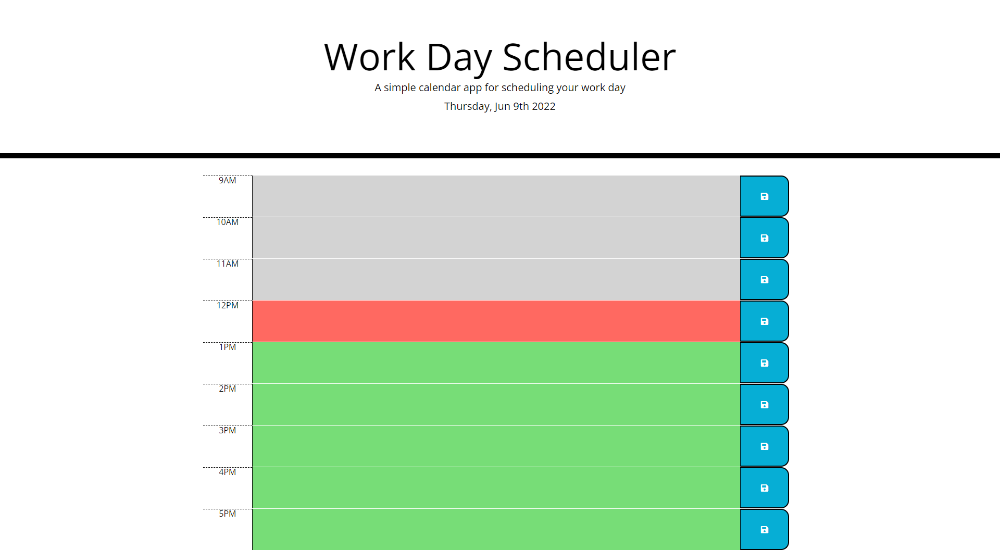

# Work-Day-Scheduler

A daily planner for a work day from 9 AM to 5 PM to organize your work. Color-coded text blocks display which part of the day it is. Also, any text that you have entered and saved.

## Screenshot

## Github-Page

https://dmartino24.github.io/Work-Day-Scheduler/
